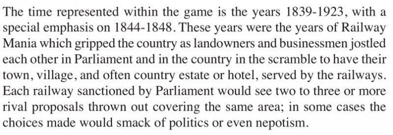
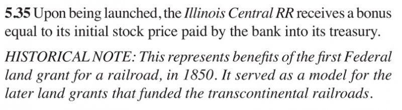
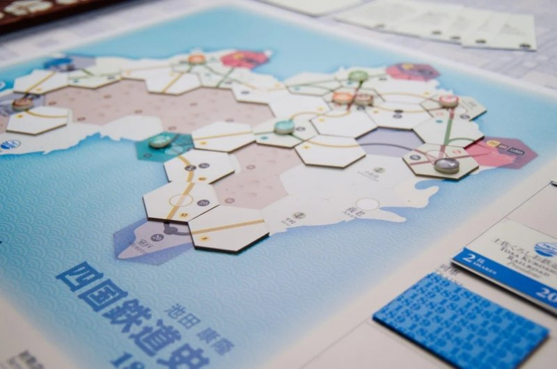
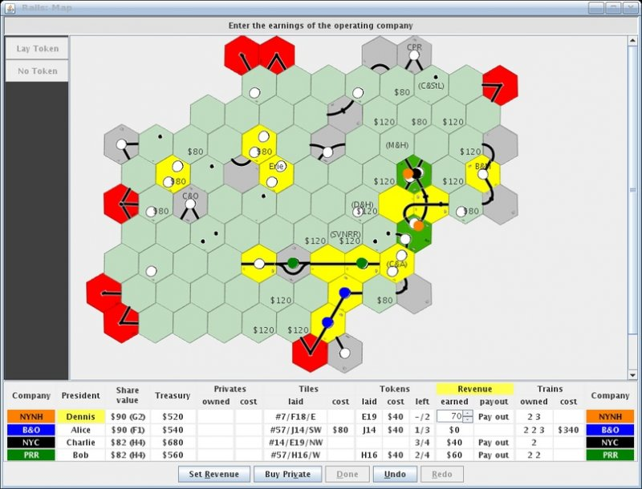
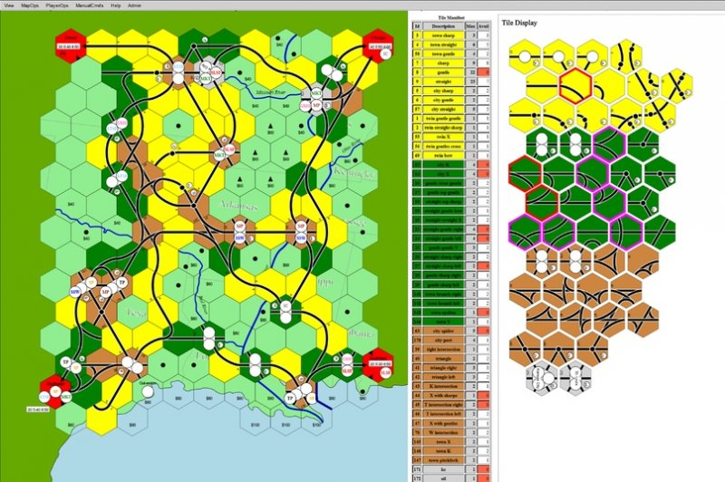

# Иллюстрированное введение в семейство 18xx

**Автор**: Дмитрий Лесков

Среди экономических настольных игр особое, выделенное место занимает так
называемое семейство игр 18xx. В России эти игры до сих пор практически
неизвестны, их совсем не найти в магазинах и очень редко можно увидеть на
барахолках. Но на Западе поклонников у них достаточно много, чтобы устраивать
конвенты, целиком посвящённые 18xx.

На фото — моя скромная коллекция игр 18xx. Да, скромная, энтузиасты со стажем (и
деньгами, да) имеют по несколько десятков коробок, а то и больше:

 *Copyright © Tyler McLaughlin (@e.e.goings на BGG).*

Неудивительно, что многие из них размер своей коллекции определяют в терминах «у
меня N игр, не считая 18xx», а в личных топах на первое место ставят не одну из
них, а «18xx», потому что иначе других игр в топе (почти) не будет. Некоторые
доходят до того, что в принципе не играют в другие настольные игры, подобно
упоротым варгеймерам.

Почему так? Попробуем разобраться.

## Что это за игры?

18xx – это семейство экономических игр о компаниях-пионерах строительства
железных дорог в разных странах и регионах. Каждый игрок в них действует и как
инвестор/спекулянт, вкладывая деньги в акции железнодорожных компаний и торгуя
ими, и одновременно как руководитель компаний, в которых он владеет наибольшими
пакетами акций.

Если не для всех, то для абсолютного большинства игр семейства характерно
следующее:

‣ Компании в игре являются отдельными экономическими субъектами с собственными
активами — денежными средствами, поездами, возможно, акциями и так далее. При
этом число компаний превышает число игроков, т. е. один игрок вполне может
руководить двумя и более компаниями. На фото ниже — активы одного игрока и
руководимых им двух компаний.

 *Игра 1846: The Race for the Midwest*

‣ Победителем становится игрок, обладающий наибольшим капиталом на момент
окончания игры. Капитал игрока составляют наличные средства и акции, учитываемые
по текущим котировкам. Денежные средства компаний в расчёте капитала их
руководителей и прочих акционеров никак не учитываются.

‣ Действие игры происходит в реально существующем регионе — на острове, в
отдельно взятом штате или провинции и так далее, вплоть до целого континента.
Игровое поле представляет собой упрощённую географическую карту, покрытую
гексагональной сеткой, в которую по ходу игры выкладываются тайлы с фрагментами
путей. На поле имеются пункты назначения нескольких типов — города, крупные
города, внешние направления — и особенности рельефа местности, удорожающие
прокладку путей в некоторых клетках. Например, вот так выглядит область в районе
Детройта на поле игры 1846: The Race for the Midwest перед началом партии:

‣ Раунды, в которых игроки покупают и продают акции компаний, чередуются с
раундами, в которых игроки направляют их хозяйственную деятельность — прокладку
путей, строительство станций, закупку подвижного состава, поиск самых выгодных
маршрутов и распределение прибыли между компанией и акционерами. Область,
изображённая на предыдущем фото, ближе к концу партии может выглядеть, к
примеру, вот так:

‣ В игре несколько поколений поездов, которые входят в игру в хронологическом
порядке. Покупка какой-либо компанией первого поезда очередного поколения
знаменует собой начало соответствующего периода развития технологий. В такие
моменты некоторые правила игры меняются: появляется возможность прокладывать
пути более сложных конфигураций, растёт прибыль от внешних направлений,
становятся доступны или недоступны дополнительные действия или варианты основных
действий. А главное, устаревают и выходят из игры поезда самого старого
поколения. Оставшись без поездов и денег на их покупку, компания из актива
превращается в обременение для своего руководителя. Возможно, это самая
гениальная находка Фрэнсиса Трешэма, автора первых игр серии.

‣ При всей простоте модели авторы стараются вплести в игры исторические детали.
Помимо реальной географии, используются названия и логотипы реально
существовавших компаний. На картах поездов изображены не абстрактные или абы
какие локомотивы, а те, что строились и эксплуатировались в данном регионе в те
годы:

 *Игра 1846: The Race for the Midwest*

В правилах зачастую присутствует целый раздел «Историческая справка», да ещё и
со списком литературы.

 *Выдержка из раздела Design Notes правил к игре 1862: Railway
Mania in the Eastern Counties.*

*В ней есть особые Парламентские раунды, в которых игроки могут основывать
компании с господдержкой, но для этого нужно выиграть аукцион (по сути,
определить, кто готов дать самую большую взятку парламентариям).*

 *Список литературы из правил к игре 1846: The Race for the
Midwest.*

Специальные правила тоже не с потолка берутся:

 *Выдержка из правил игры 1846: The Race for the Midwest.*

Наконец, годы XIX века в названиях большинства игр отсылают к датам начала
строительства железнодорожных сетей в соответствующих регионах или другим важным
событиям из этой области деятельности.

Говоря об истории, нельзя обойти вниманием историю появления самих игр 18xx.
Первой была [1829](https://www.boardgamegeek.com/boardgame/1823/1829), вышедшая
аж в 1974 году. В ней уже присутствовали основные черты семейства, но был также
и механизм, симулирующий конкуренцию за земельные участки, от которого автор в
дальнейшем отказался, так как он сильно затягивал игровой процесс. Из-за него
1829 (не путать с [1829
Mainline](https://www.boardgamegeek.com/boardgame/13924/1829-mainline)!) в
настоящее время представляет в основном коллекционный и исторический интерес.

Трешэм вернулся к идее спустя 12 лет. Нельзя сказать, что он зря терял время,
выпустив, в частности,
[Civilization](https://www.boardgamegeek.com/boardgame/71/civilization). Но в то
время как 1829 вознаграждала обладателей пакетов акций наиболее прибыльных
компаний, в [1830: Railways & Robber
Barons](https://www.boardgamegeek.com/boardgame/421/1830-railways-robber-barons),
как уже само её название подсказывает, автор сместил фокус на манипуляции на
фондовом рынке. По большому счёту, именно 1830 явилась основоположницей
семейства 18xx. Она до сих пор является самой популярной, держась во второй
сотне рейтинга BGG, неоднократно переиздавалась (последний раз Lookout в 2018
году) и многие считают её лучшей. [Брюс
Шелли](https://en.wikipedia.org/wiki/Bruce_Shelley), в те годы сотрудничавший с
Avalon Hill, написал интересную [статью об истории создания
1830](https://www.westpark-gamers.de/index.html?/1830dev.html) для собственного
журнала компании.

## Почему их так много?

Так исторически сложилось. Трешэм не особенно торопился выпускать новые игры
серии, а 1853, с её предельным уклоном в хозяйственную деятельность, большей
части ЦА не понравилась. Неудивительно, что нашлись энтузиасты, которые стали
придумывать свои игры на основе этой системы, от «1830 на другой карте» до
вполне оригинальных, распространять их бесплатно как PnP или кустарно издавать.
И некоторые из этих игр оказались настолько удачными, что нашлись, в свою
очередь, желающие их издать. Одной из первых, если не самой первой такой игрой
была [1870: Railroading across the Trans Mississippi from
1870](https://www.boardgamegeek.com/boardgame/424/1870-railroading-across-trans-mississippi-1870),
общепризнанный шедевр в части стартового баланса.

Сейчас трудно себе представить, чтобы кто-нибудь в здравом уме решился издать
игру вроде «Брасс» на другой карте с некоторыми изменениями правил». Затаскают
по судам. А тогда Трешэм не возражал и не требовал делиться, только просил
ссылаться на свою систему в правилах.

И всё заверте…

Сейчас количество[ записей в категории 18xx в базе данных
BGG](https://www.boardgamegeek.com/boardgamefamily/19/series-18xx/linkeditems/boardgamefamily?pageid=1&sort=rank)
подбирается к двум сотням (с дополнениями превосходит). До варгеймов с их почти
20 000 записей, конечно, далеко, но ведь и железнодорожную сеть в каждом регионе
строили один раз, а военные конфликты устраивали неоднократно, да и
пространственно-временной диапазон у варгеймов пошире.

## Чем они отличаются?

Итак, в чём же принципиальное отличие системы 18xx от систем, лежащих в основе
других экономических игр? Почему в этой, казалось бы, узкой нише царит такое
биоразнообразие? У меня есть собственная теория на этот счёт, которую я
незамысловато назвал теорией мульти-дуализма:

* Два принципиально разных типа экономических агентов — игроки и компании,
причём вторые ощущаются более полноценными, чем, скажем, в играх на системе cube
rails (*Chicago Express*, *Irish Gauge* и тому подобное). У компаний конкретные
руководители, собственный порядок хода и более разнообразный набор действий.
* Каждый игрок поочерёдно играет две роли — то инвестора/спекулянта, то
руководителя железнодорожной корпорации.
* Железнодорожная сеть общая (что исторически менее достоверно, чем
принадлежащие конкретным игрокам перегоны в *Age of Steam* и подобных играх), но
станции при этом принадлежат конкретным компаниям и могут блокировать доступ к
частям сети для других.
* В одном раунде двум или более игрокам или компаниям может быть выгодно
действовать совместно, например, обрушить курс акций лидера или проложить пути
навстречу друг другу, а буквально в следующем раунде они могут стать злейшими
врагами.
* Поезда являются одновременно и активом, и таймером. Игроку — руководителю
компании может быть выгодно потратить её деньги на «лишний» поезд, который ни
разу не принесёт прибыли, а то и на несколько таких поездов, чтобы сменить фазу
игры и получить выгоду как инвестор или нанести ущерб компаниям-конкурентам.
* В семействе есть игры, в которых обычно побеждает собравший портфель акций
самых прибыльных компаний, а есть и такие, в которых побеждает самый ловкий
спекулянт, несмотря на результаты хозяйственной деятельности.

## С чего начать?

Группе любителей сложных экономических игр типа *«Брасса»*, *Food Chain
Magnate*, *Wildcatters* и тому подобных практически всё равно, с какой именно
игры начинать знакомство с 18xx. Если же вы пока единственный энтузиаст в своей
группе, лучше начать с одной из базовых игр.

## Какую же выбрать?

Классификация настольных игр — занятие неблагодарное, но самое распространённое
мнение гласит, что все игры семейства можно разделить на две ветви — наследники
соответственно 1829 и 1830 или, как их называют, *операционные* (operational) и
*финансовые* (financial). Естественно, деление не строгое, в каждой игре
присутствуют и те, и другие элементы, вопрос в том, в какой пропорции между ними
распределяется внимание игроков.

Джонатан Пиклз построил целый граф влияния ранее вышедших игр на дизайн более
новых, в котором эти две ветви вполне прослеживаются:

 *Copyright © 2020 [Jonathan
Pickles](https://www.facebook.com/jonathan.pickles.33), Facebook Train Board
Game Group. Воспроизведено с разрешения автора.*

Я бы рекомендовал сначала сыграть в одну финансовую и одну операционную игру,
чтобы понять, что вашей группе больше нравится.

### Финансовые

* **[1830: Railways & Robber
Barons](https://www.boardgamegeek.com/boardgame/421/1830-railways-robber-barons)**
(1986) — классика вечна, плюс, самый базовый набор правил; в терминах отличий от
1830 целый ряд игр можно описать очень кратко. Однако относительно большая
продолжительность партии в сочетании с высокой ценой ошибки могут отпугнуть
новичков.
* **[18Chesapeake](https://www.boardgamegeek.com/boardgame/253608/18chesapeake)**
(2020) — на первый взгляд, правила очень похожи на 1830, но по факту более
строгие и ограничивают свободу рыночных манёвров, а набор тайлов, наоборот,
менее требователен к планированию сети. Дело в том, что эта игра была
разработана специально для новичков. К сожалению, таблица котировок в ней
значительно упрощена по сравнению с 1830 и простор для финансовых махинаций, как
я уже говорил, заметно сужен. Есть отдельный вариант для двух игроков.
* **[1889: History of Shikoku
Railways](https://www.boardgamegeek.com/boardgame/23540/1889-history-shikoku-railways)**
(2004) — ещё одна относительно быстрая вариация на тему 1830. Таблица котировок
в ней существенно ближе к оригиналу, но самый, возможно, знаменитый трюк из
арсенала ветеранов 1830 здесь провернуть не удастся. Есть PnP (см. ниже).
* **[18MEX](https://www.boardgamegeek.com/boardgame/18485/18mex)** — здесь
отличий уже побольше, но это всё ещё 1830, хоть и «с мексиканскими приправами».

### Операционные

* **[1846: The Race for the
Midwest](https://www.boardgamegeek.com/boardgame/17405/1846-race-midwest)**
(2005) — творение Тома Леманна (да-да, автора Race for the Galaxy) специально
для любителей евро-игр.
* **[18MS](https://www.boardgamegeek.com/boardgame/313129/18ms-railroads-come-mississippi)**
(2015, на BGG указан год выхода отдельной коробкой) — игра очень быстрая
(заявлено 2 часа), но чересчур упрощённая. И слишком уж в ней много отличий от
большинства 18xx, придётся потом переучиваться.
* **[18CZ](https://www.boardgamegeek.com/boardgame/163841/18cz)** (2017) — не
самая простая и быстрая, но в комплекте идут аж две дополнительные карты для 2–3
игроков и варианты с упрощёнными правилами и небольшим временем партии. А
главное, в ней есть интересный режим игры вдвоём — третий «игрок» по имени
Вацлав, за которого ходят оба настоящих игрока.
* **[1861: The Railways of the Russian
Empire](https://www.boardgamegeek.com/boardgame/23817/1861-railways-russian-empire)**
— нельзя было не упомянуть хотя бы из географических соображений. В ней есть
дополнительные механики — слияния, национализация, — поэтому освоить её будет
сложнее. Зато в [новом
издании](https://www.boardgamegeek.com/boardgame/292187/18611867) будет короткий
вариант, 1861s, и вторая игра — [1867: Railways of
Canada](https://www.boardgamegeek.com/boardgame/227143/1867-railways-canada), с
похожими правилами. Можно даже с 1867 и начать, она немного проще.

## Где взять?

До совсем недавнего времени массово, с фабричным качеством и по приемлемым
ценам, 18xx издавало только Lookout Games (1830,
[1844/1854](https://www.boardgamegeek.com/boardgame/183308/18441854)). На
сегодня 1830 ещё можно найти в европейских магазинах. Несколько лет назад
подключилось GMT, но первый тираж 1846: The Race for the Midwest уже распродан,
[1862: Railway Mania in the Eastern
Counties](https://www.boardgamegeek.com/boardgame/66837/1862-railway-mania-eastern-counties)
заканчивается, а второй тираж 1846 и другие игры, в том числе совсем новая
[1833NE](https://www.boardgamegeek.com/boardgame/31619/1833ne) того же Тома
Леманна, ещё не вышли. Качественно издаёт свои игры [Лонни
Орглер](https://www.lonny.at/), но они подороже и в среднем не так высоко
котируются.

Слава «Кикстартеру», исторически кустарное издательство [All-Aboard
Games](https://all-aboardgames.com/) в этом году перешло на массовое
производство и уже издало/переиздаёт и целый ряд классических игр, и собственную
игру владельца издательства, вышеупомянутую 18Chesapeake, и новинки, в том числе
очень интересную по отзывам [1882:
Assiniboia](https://www.boardgamegeek.com/boardgame/282435/1882-assiniboia). К
сожалению, цены у AAG негуманные, но есть дешёвая международная доставка. Совсем
новое Grand Trunk Games должно уже скоро отгрузить 1861/1867 и уже объявило, что
следующая кампания будет по 1889. Старое немецкое издательство Marflow Games
выкатило [18DO:
Dortmund](https://www.boardgamegeek.com/boardgame/238957/18do-dortmund), в
которую, внезапно, добавлены пивоваренные компании.

Если вас не останавливает своеобразие 18MS, AAG готовит её к переизданию и
принимает предзаказы.

Не готовы платить столько денег, не будучи уверенными, понравится ли вам и вашей
группе игра? Во первых, почти все игры можно попробовать онлайн (см. ниже).
Во-вторых, у некоторых игр есть [PnP-комплекты на
BGG](https://www.boardgamegeek.com/geeklist/58420/18xx-available-pnp). Список
несколько устарел и в нём в основном малоизвестные игры, которые не очень высоко
котируются, но есть несколько весьма неплохих. Как раз одну их них, 1889, мы
себе и сделали. По-моему, получилось неплохо:

(Кроме 1889, я сделал ещё только одну игру, чисто карточную, не 18xx, и больше
не хочу — слишком много возни. Но у кого рука набита, сделает на раз. А если
заказать деревянные жетоны с наклейками в
[RailsOnBoards](https://www.railsonboards.com/), будет не отличить от
фабричной.)

## Как ускорить игру?

Как ни странно, даже любители сложных экономических игр зачастую обходят
стороной 18xx. Пожалуй, основная причина этого — продолжительность партии.
«Штатное» время для 1830 — три-шесть часов, и это если все игроки уже сыграли
хотя бы по паре-тройке партий. Что с этим можно сделать?

**Во-первых**, используйте покерные фишки вместо бумажных денег. По ходу партии
постоянно происходят расчёты между игроками, компаниями и банком. Их гораздо
больше, чем в играх, где экономическими агентами являются только сами игроки. Из
нескольких секунд, которые фишки по сравнению с бумажными деньгами экономят на
каждой транзакции, запросто набегают полчаса. Дешёвые фишки «с Али» вполне
годятся, если не скользкие — ронять их на поле очень нежелательно. Но если
средства позволяют, [Iron
Clays](https://iron-clays-and-spades.backerkit.com/hosted_preorders) («фишки из
«Брасса») или [Apache
Bank](https://www.apachepokerchips.com/product/bank-18xx-board-games-poker-chips/)
добавят игрокам приятные визуальные и тактильные ощущения.

 *Я использую набор из четырёхсот фишек Apache Bank.*

**Во-вторых**, вскоре после входа в игру постоянных поездов, а это происходит
примерно на середине партии, уже может быть понятно, кто победит. Если никто не
хочет оспорить первое место, поздравьте победителя и начните заново.

**В-третьих**, в последней серии операционных раундов суммы прибыли компаний
зачастую почти не меняются. Вколотите данные последнего раунда предыдущей серии
в [электронную
таблицу](https://docs.google.com/spreadsheets/d/1rq0th6SstW2cqPf_NCfXMLUjGbfkp2ZaeknQzEo9xos/edit?usp=sharing)
и посчитайте итоговый результат, как если бы в последней серии компании только
получили прибыль с тех же самых маршрутов и выплатили дивиденды. Если разница
между соседними местами окажется больше нескольких процентов, отыгрывать
последнюю серию смысла нет.

*У Эрика такой отрыв, что нет смысла играть последние три операционных раунда,
разве что если Алиса и Боб хотят поспорить за второе место (данные из реальной
партии в 1889).*

**В-четвёртых**, можно заметить, что по ходу операционных раундов игроки обычно
не тратят деньги. Если насчитывать причитающиеся им дивиденды нарастающим
итогом, опять же в [электронной
таблице](https://drive.google.com/file/d/0B80xuSDRR3Fzcm9aYUdBanB0TU1rV3F0Z2d5QTN0YkFoQjFz/view),
и выплачивать их все разом перед началом фондового раунда, количество транзакций
очень существенно снизится. Ещё полчаса с времени партии долой.

**В-пятых**, некоторые игры заканчиваются немедленно при банкротстве одного
игрока. Играйте агрессивнее.

Но самым правильным лично я считаю приём, о котором рассказал Джо Хубер в[ 13-м
выпуске подкаста Train
Shuffling](https://anchor.fm/trainshuffling/episodes/Episode-13---Just-Play-Faster-with-Joe-Huber-efku6q).
Благодаря ему группа Джо играет в 1846, на коробке у которой написано «2–4
часа», за полтора часа — не напрягаясь, за два с половиной — с хиханьками и
общением на [стриме Heavy
Cardboard](https://www.youtube.com/watch?v=_DI9HEo73gk), и за 46 минут — «на
слабо».

Приём очень прост: играть быстро, не боясь ошибиться. «Эффект бабочки» в 18xx
настолько силён, что начинающий игрок всё сделает правильно разве что случайно.
Лучше по-быстрому набить шишек, обанкротиться и успеть сыграть вторую партию.

Некоторые группы используют таймер. Мы иногда берём DGT Cube в режиме подсчёта
времени каждого игрока — не давит, но по ощущениям исподволь подгоняет.

## Где поиграть онлайн?

18xx прекрасно подходят для асинхронной игры через Интернет. Есть целый ряд
сайтов и приложений, где можно найти почти любую из вышедших и даже ещё не
вышедших игр.

[18xx.games](https://www.18xx.games/) — совсем новый, но бешеными темпами
развивающийся сайт, появившийся в 2020 году. Число игр уже перевалило за десять
и включает в том числе часть из рекомендованных выше для старта: 1846, 1889,
18Chesapeake. Реализован полный контроль правил, есть режим hotseat, можно
одному поиграть за нескольких игроков, чтобы освоить правила или протестировать
стратегии.

 *Окончание партии в 18Chesapeake на 18xx.games.*

[BOARD18](https://board18.org/) — отслеживается только состояние поля, активы
учитываются отдельно в гугл-таблице, взаимодействие по email или через
мессенджер. Никакого контроля правил, но именно поэтому мне этот вариант
нравится больше прочих, так как я гораздо более внимательно разбираю чужие ходы.
Для обучения самое то. Плюс, выбор игр самый широкий.

 *Окончание партии в 1846 на BOARD18.*

[Rails](https://rails.sourceforge.io/) — Java-приложение, исходно
предназначалось для игры по email, но сейчас сохранённые игры обычно выкладывают
в общую папку в облаке. Полный контроль правил, автоматический выбор оптимальных
маршрутов (что я лично не люблю), hotseat.

 *Партия в 1830 в Rails.*

[rr18xx](http://www.rr18xx.com/) — старый, жутко медленный сайт, но на нём есть
очень хорошие игры — 1830, 1870, 1817 — и полный контроль правил.

 *Партия в 1870 на rr18xx.*

Если же вы предпочитаете играть «вживую», в Tabletop Simulator уже довольно
много 18xx.

 *Окончание партии в 1846 в Tabletop Simulator.*

Наконец, для iOS есть приложение [Survey
Party](https://apps.apple.com/ru/app/survey-party/id982257563), в котором можно
играть офлайн.

*Партия в 1850 в Survey Party.*

Спасибо всем, кто дочитал до конца, надеюсь, вам было интересно.
